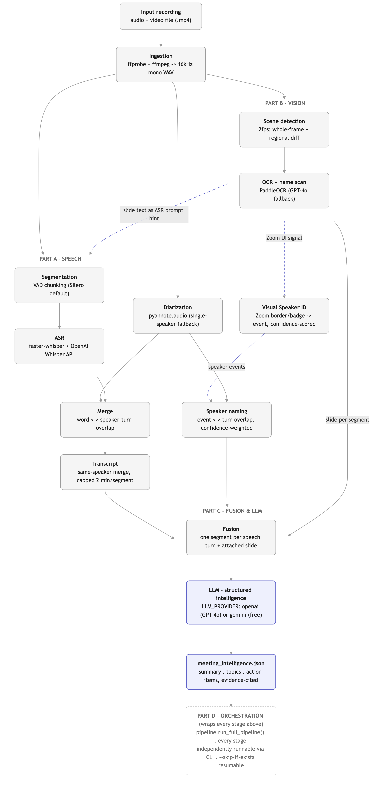
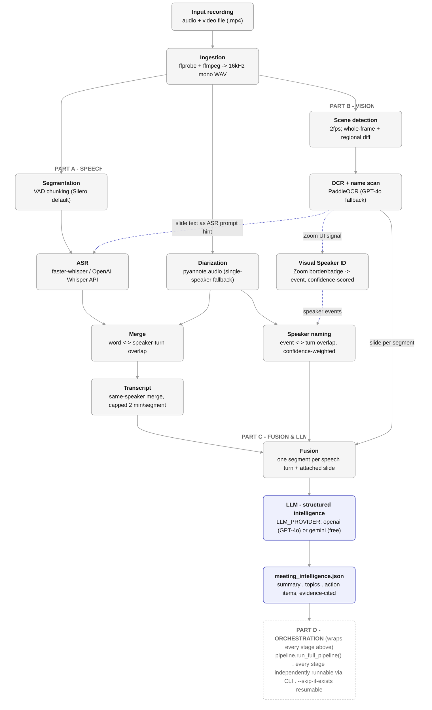

# Multimodal Meeting Intelligence Pipeline

Turns a raw meeting recording (`.mp4`) into structured conversation
intelligence: a summary, topics with evidence, and action items with
word-for-word evidence quotes -- grounded in what was actually said and
what was actually on screen.

The pipeline fuses two parallel tracks onto a single utterance-level
timeline before handing it to an LLM:

- **Speech track**: voice activity detection -> speaker diarization -> ASR
  transcription -> word/speaker-turn merge.
- **Vision track**: scene (slide) detection -> OCR & on-screen name scan.

The two tracks feed back into each other on purpose (see
[Cross-module dependencies](#cross-module-dependencies) below), the way a
production conversation-intelligence platform would.

See [`docs/TECHNICAL_REPORT.md`](docs/TECHNICAL_REPORT.md) for a summary of
the system architecture, design decisions, model choices, evaluation
against real footage, production considerations, and known limitations.

## Architecture



Dashed blue arrows are cross-modal signals (Vision -> Speech/Naming); solid
gray arrows are ordinary stage data contracts.

*Rendered from `docs/architecture.mmd`. Regenerate after editing it with:
`npx -y @mermaid-js/mermaid-cli -i docs/architecture.mmd -o docs/architecture.png -b white -s 3 -C docs/mermaid-fix.css -p docs/mermaid.puppeteer.json`
(`docs/mermaid-fix.css` works around a mermaid-cli bug that clips the right
edge of subgraph title text).*

<details>
<summary>Mermaid source (docs/architecture.mmd)</summary>



</details>

### Diagram walkthrough

| Stage | What happens | Module |
|---|---|---|
| **Ingestion** | Validates the `.mp4` with `ffprobe` (rejects files with no audio stream) and extracts the audio to a standardized 16kHz, mono, 16-bit WAV with `ffmpeg`. Every downstream stage depends on this WAV. | `ingestion.py` |
| **Segmentation** | Silero VAD (default config) partitions the WAV into clean speech-active chunks, discarding silence. | `segmentation.py` |
| **Diarization** | pyannote.audio clusters speaker embeddings into turns (`Speaker_00`, `Speaker_01`, ...) with start/end boundaries. If pyannote fails to load or run, falls back to a single `Speaker_00` turn spanning the whole recording rather than crashing. | `diarization.py` |
| **Scene detection** | Samples video frames at 1fps and flags a new "scene" (slide) when either the whole-frame pixel difference or a regional (3x3 grid) max-cell difference crosses a threshold -- catching both full slide changes and localized changes (e.g. a callout appearing). | `scene_detection.py` |
| **OCR + name scan** | Runs PaddleOCR on each detected scene frame (onnxruntime backend -- see [Speaker name detection](#speaker-name-detection)); if PaddleOCR's confidence is too low, falls back to GPT-4o vision for the OCR text itself. Produces two things downstream needs: per-frame OCR text (each frame keeps its own timestamp + lines, for ASR to look up) and a detected `display_name` (for speaker naming). Frames with no legible text are skipped gracefully. `display_name` detection itself tries two Zoom-specific pixel-region detectors (`zoom_layout.py`) first, then a free whole-frame name-shape scan, then GPT-4o vision as a last resort -- see [Speaker name detection](#speaker-name-detection). | `ocr.py` |
| **Visual Speaker Identification** | Turns Zoom-UI-sourced frames (`display_name_source` of `"active_speaker_border"` or `"presentation_badge"` -- never the generic name-shape scan or GPT-4o) into `VisualSpeakerEvent`s: which detector fired *is* the layout (border only ever appears in gallery view, badge only in shared-screen/presentation mode); consecutive frames with the same signal + name merge into one event; each event's confidence fuses OCR confidence, a fixed per-signal structural-match confidence, and a multi-frame consistency bonus. | `visual_speaker.py` |
| **ASR** | faster-whisper (or the OpenAI Whisper API) transcribes each VAD chunk, word-level timestamps + detected language included. For each chunk, looks up the *one* slide that was on screen when that chunk ended (`alignment.find_active_frame`) and uses only that slide's OCR text as Whisper's `initial_prompt` -- not every slide seen anywhere in the recording. | `asr.py` |
| **Merge** | Every ASR word is assigned to whichever diarized speaker turn it overlaps the most (word-level timestamp overlap), producing one `RawUtterance` per speaker turn -- an intermediate handoff, not itself persisted. | `merge.py` |
| **Transcript** | Merges consecutive `RawUtterance` turns from the *same* speaker (diarization sometimes splits one continuous turn into several back-to-back turns) into a single `TranscriptSegment`, the record actually written to `transcript.json` and consumed by Fusion. Caps how long that merge can grow (`TRANSCRIPT_MAX_SEGMENT_DURATION_SEC`, default 120s = 2 minutes): a speaker holding the floor across many consecutive turns still gets split into multiple segments at existing turn boundaries, rather than merging into one unbounded block. | `transcript.py` |
| **Speaker naming** | First clusters event `display_name`s that are OCR-noise variants of the same reading (string similarity) into one canonical name, then aligns each `VisualSpeakerEvent` with every diarization speaker turn it overlaps in time, weighting the match by the event's own confidence scaled by how much of the *event's* timespan that turn covers. Summing that weighted evidence per (name, speaker) pair and taking whichever speaker holds the largest share of a name's total weight gives a 0-1 alignment confidence; a name must clear a threshold to resolve (see [Speaker name detection](#speaker-name-detection)). Speakers with no confidently-resolved name are labeled `"Unknown"`. | `speaker_naming.py` |
| **Fusion** | An interval-overlap algorithm attaches the slide that was on screen to each utterance, producing the `FullyAlignedTimeline` the LLM consumes. | `fusion.py` |
| **LLM - structured intelligence** | Feeds the fused timeline to GPT-4o or Gemini Flash (`LLM_PROVIDER`) using each provider's native structured-output / JSON-schema mode, constrained to the `MeetingIntelligence` schema and grounded by the guardrail system prompt (see below). | `llm.py` |

### Cross-module dependencies

The two dashed arrows in the diagram are the architecture's deliberate
feedback loops, mirroring how production conversation-intelligence
platforms use vision to improve speech understanding:

1. **OCR text -> ASR prompt hint**: for each ASR chunk, the slide text
   active at that specific moment (matched by timestamp, not the whole
   file's slides) is passed into Whisper's `initial_prompt` to reduce Word
   Error Rate on names/jargon that only appear on screen.
2. **Zoom UI signals -> Visual Speaker Identification -> Speaker naming**:
   display names read directly off Zoom's own active-speaker border /
   presentation badge (never inferred from slide content) become
   `VisualSpeakerEvent`s, which are then aligned with speaker turns by
   temporal overlap, mapping `Speaker_00` -> `"Maria Alvarez"`.

## Speaker name detection

`display_name` detection (`ocr.py`) tries three approaches, in order:

1. **Local border/badge-crop heuristics (primary)** -- tried first because
   they're anchored to Zoom's own UI chrome, so more trustworthy than
   pattern-matching arbitrary slide text whenever that UI is present and
   calibrated (see [Known limitations](#known-limitations) for the "Te
   Waka" false positive this ordering fixes). Tuned to Zoom's specific UI
   (`zoom_layout.py`), since a speaker overlay shows up in two predictable
   places rather than scattered anywhere on screen:
   1. *Gallery/speaker view*: Zoom draws a colored border around whoever is
      currently talking. `find_active_speaker_tile` looks for that border
      (green by default -- measured off real footage, hue ~42-50) via an
      HSV color mask -- with morphological
      closing first, to bridge small gaps a thin outline can develop from
      anti-aliasing or video compression -- then crops just the
      **bottom-left** corner of that tile, where Zoom actually anchors the
      name pill, and OCRs it. Cropping the full width/height instead would
      risk also catching a participant-count badge or mute/video-status
      icon elsewhere in the tile -- exactly the kind of stray text that
      once caused a `"4"` to be misread as someone's name (see
      [Known limitations](#known-limitations) for the separate
      non-numeric-line guard that also protects against this).
   2. *Presentation/screen-share mode*: Zoom overlays a small "who's
      talking" badge (video thumbnail + name) in the top-right corner. A
      fixed crop locates the whole badge, then `crop_badge_name_label`
      narrows that down to just its bottom strip, where the name sits
      below the thumbnail.
2. **Whole-frame name-shape scan (fallback, free)** -- used when the
   border/badge detectors above are disabled or find nothing (e.g. Zoom's
   theme/version isn't calibrated for this deployment). `detect_display_name_via_layout`
   reuses the same whole-frame OCR pass already run for slide content: it
   picks the largest-font line near the top as the slide's `title` (not
   necessarily whichever line OCR happened to read first), then scans every
   *other* line for one shaped like a short "Firstname Lastname" name
   (`is_name_shaped` -- a Title-Case, <=4-word phrase, with an optional
   honorific/middle initial). No API key, no extra latency, no
   per-deployment tuning -- but it can false-positive on any other
   Title-Case, <=4-word slide text (an org name, a place name) that happens
   to read as name-shaped, which is why it no longer runs first. A lone
   name-shaped line with nothing else on the frame is treated as the title
   instead (ambiguous otherwise), not a name.
3. **GPT-4o vision on the whole frame (last resort)** -- `detect_display_name_via_gpt4o`
   sends the full frame to GPT-4o with a prompt asking it to visually find
   and read the speaker's name, for frames whose name tag isn't readable as
   a clean OCR line (occluded, stylized, very small) and whose border/badge
   isn't detected either. Costs one vision API call per such frame
   (requires `OPENAI_API_KEY`); skipped entirely if either of the above
   already found a name.

`display_name_source` on each frame records which of the four
(`"layout_heuristic"`, `"gpt4o_vision"`, `"active_speaker_border"`,
`"presentation_badge"`) actually produced the name, so you can tell at a
glance which path is firing on your footage.

### Visual Speaker Identification: `display_name` -> `VisualSpeakerEvent`

`display_name` is a single greedy pick per *frame*; Speaker Naming needs
evidence spanning *time*, and needs to trust structural Zoom UI signals
more than a name-shape guess from arbitrary text. `visual_speaker.build_visual_speaker_events`
bridges the two, and is deliberately scoped to genuine Zoom UI signals
only -- a frame whose `display_name_source` is `"layout_heuristic"` or
`"gpt4o_vision"` (a guess from slide text, not Zoom's own chrome) is never
turned into an event, exactly to avoid a repeat of the `"Acme Corp"` false
positive above:

1. **Detect layout** -- which detector fired *is* the layout, at zero
   extra cost: Zoom only ever draws the colored active-speaker border in
   gallery/speaker-grid view, and only ever shows the "who's talking"
   badge during screen-share/presentation mode, so the two are mutually
   exclusive by construction. `"active_speaker_border"` -> `"gallery_view"`;
   `"presentation_badge"` -> `"shared_screen"`.
2. **Merge consecutive frames** -- consecutive sampled frames with the
   same `(signal, display_name)` merge into one event spanning their
   combined timeframe; more corroborating frames is real evidence the
   detection wasn't a one-off misread.
3. **Score confidence** -- fuses (a) the event's average OCR confidence
   (weight 0.5), (b) a fixed per-signal structural-match confidence --
   0.85 for the border (a real HSV color-mask + area-fraction match
   against calibrated thresholds) vs. 0.65 for the badge (a fixed-position
   crop with no content-based confirmation a badge is even visible there)
   -- weighted 0.3, and (c) a consistency bonus (weight 0.2) that
   saturates at 3 corroborating frames.

Before alignment, `speaker_naming._canonicalize_names` clusters event
`display_name`s by string similarity (stdlib `difflib.SequenceMatcher`
ratio, case-insensitive, default threshold 0.65): PaddleOCR reads the same
badge/border name-crop slightly differently frame to frame on real
footage (e.g. `"Maria Alvarez"` / `"Marla Alvarez"` / `"Mara Alvarez"` --
a substituted or dropped letter), and without this step that noise
fragments one person's evidence across several near-identical strings,
none of which individually accumulates enough weight to resolve
confidently. Each cluster's canonical form is whichever variant has the
highest *total* confidence summed across all its occurrences (a proxy for
"most/best-corroborated reading"). The 0.65 default leaves a comfortable
margin between single-letter OCR noise on the same name and any two
genuinely different short names -- see `speaker_naming.py`'s module
docstring.

`speaker_naming.build_speaker_name_map` then aligns each (canonicalized)
`VisualSpeakerEvent` with every diarization speaker turn it overlaps in
time, weighting the match by `event.confidence * overlap_fraction` (how
much of the *event's* own timespan that turn covers -- an event that only
brushes a turn boundary counts far less than one fully inside it). Summing
that weighted evidence per `(name, speaker_id)` pair and taking whichever
speaker holds the largest share of a name's total weight gives a single
0-1 alignment confidence, which already captures temporal overlap and
cross-event consistency: a name split about evenly across two speakers
(e.g. visible near both, or one high- and one low-confidence event
pointing different ways) naturally lands near the middle and fails to
clear `speaker_naming_min_confidence` (default 0.6), rather than being
confidently -- and possibly wrongly -- assigned to whichever speaker it
happened to edge out. When two different names both resolve to the same
speaker, the one backed by more total weight of evidence wins the slot --
*not* just the higher confidence ratio, since a single isolated,
uncontested event is trivially 100% "confident" (there's no competing
evidence to dilute it) without actually being more trustworthy than a
much better-corroborated cluster that happens to have a little competing
noise. A speaker with no confidently-resolved name is labeled `"Unknown"`:

```json
{
  "start": 12.10,
  "end": 18.45,
  "display_name": "Ken Morris",
  "layout": "gallery_view",
  "signal": "active_speaker_border",
  "confidence": 0.93
}
```

PaddleOCR itself runs on the **onnxruntime** inference backend
(`engine="onnxruntime"` in `load_paddle_ocr`) rather than its default
`paddle_static` engine, which needs the separate `paddlepaddle` package --
notorious for lagging PyPI wheel coverage on newer Python/OS combinations.
Photographed-document preprocessing (`use_doc_orientation_classify`,
`use_doc_unwarping`, `use_textline_orientation`) is disabled too, since it
corrects for a skewed or curled paper page -- irrelevant, and a source of
avoidable misreads, on flat screen-capture frames.

Sampled frames are processed **in chronological order**, vision-only (no
audio, no diarization), into exactly one `VisualFrameContext` record per
image:

- **`slide_id`** -- self-describing id encoding this frame's start time in
  centiseconds (e.g. `slide_000800` for 8.0s), not a running counter.
- **`start_time`** / **`end_time`** -- `end_time` is the *next* frame's
  `start_time` (a slide persists on screen until the next detected
  transition); the last frame's `end_time` is `null` (unknown without the
  video's total duration -- "if available" per the spec).
- **`content`** -- a `SlideContent` breakdown of the frame's OCR text:
  `title` (the largest-font line near the top, not necessarily whichever
  line OCR read first), `bullet_points` (short lines / lines with a bullet
  marker, marker stripped), `paragraphs` (longer flowing-prose lines), and
  `raw_text` (every original OCR line, verbatim, newline-joined). The line
  used as `display_name` (when it came from the layout heuristic) is
  excluded from bullets/paragraphs -- it's the speaker's name tag, not
  slide content.
- **`display_name`** -- the presenter's display name **read directly off
  the Zoom interface** (see [Speaker name detection](#speaker-name-detection)
  above), never an inference of the actual active speaker. `null` if
  nothing was found. A pure gallery-view frame with no slide content at
  all still gets a record (empty `content`) if a speaker was identified,
  since the point is one record per image, not "no slide -> no record".
- **`display_name_source`** -- which detector produced `display_name`:
  `"layout_heuristic"`, `"gpt4o_vision"`, `"active_speaker_border"`, or
  `"presentation_badge"`; `null` if none did.
- **`ocr_confidence`** -- average PaddleOCR confidence (0-1) for the
  frame's whole-frame text; `null` if no text was detected.
- **`detection_confidence`** -- OCR confidence (0-1) of the `display_name`
  detection, if it came from a local heuristic (whole-frame or crop);
  `null` for `gpt4o_vision` (no comparable numeric score) or when no name
  was found.

There's no separate flattened "name tags" list -- Speaker Naming (Part C)
reads `display_name` straight off each frame:

```json
{
  "slide_id": "slide_000800",
  "start_time": 8.0,
  "end_time": 14.2,
  "frame_path": "out/frames/frame_00042.png",
  "content": {
    "title": "Quarterly Roadmap",
    "bullet_points": ["Ship v2 by June"],
    "paragraphs": ["This quarter we are focused on expanding into three new international markets"],
    "raw_text": "Quarterly Roadmap\n- Ship v2 by June\nThis quarter we are focused on expanding into three new international markets"
  },
  "display_name": "Jane Roe",
  "display_name_source": "layout_heuristic",
  "ocr_confidence": 0.94,
  "detection_confidence": 0.97
}
```

**The Zoom-specific thresholds below are tried first** (see [Speaker name
detection](#speaker-name-detection) above), but they're starting points,
not guarantees -- Zoom's exact highlight color/badge position can vary by
version, theme, and layout, and I don't have your recordings to calibrate
against. When neither matches, detection falls through to the layout scan
and then GPT-4o vision. Everything is tunable via env vars or CLI flags on
the `ocr`/`vision`/`pipeline` commands:

```bash
python -m meeting_intelligence.main vision --video_path meeting.mp4 --output_dir out/ \
    --border-hue-min 20 --border-hue-max 35 \
    --border-sat-min 100 --border-val-min 100 \
    --border-close-kernel-size 5 \
    --name-label-height-fraction 0.18 --name-label-width-fraction 0.65 \
    --badge-top-fraction 0.22 --badge-right-fraction 0.22 \
    --badge-name-height-fraction 0.4

# or disable one detector entirely:
python -m meeting_intelligence.main vision --video_path meeting.mp4 --output_dir out/ \
    --no-active-speaker-detection
```

If the active-speaker border isn't green in your recordings (older Zoom
versions/themes have used yellow), inspect a frame in an image editor,
read off its HSV hue, and pass `--border-hue-min`/`--border-hue-max`
accordingly (OpenCV hue is 0-179, i.e. half the usual 0-360 degree scale).
If the border is detected but the wrong region gets OCR'd for the name
(e.g. it picks up a participant-count badge instead), check the saved
debug crop next to each frame (`<frame>_active_speaker.png` /
`<frame>_presentation_badge.png`) to see exactly what's being read, and
adjust `--name-label-width-fraction`/`--badge-name-height-fraction` to
tighten the crop. The equivalent env vars are `ZOOM_BORDER_HUE_MIN` /
`ZOOM_BORDER_HUE_MAX` / `ZOOM_BORDER_SAT_MIN` / `ZOOM_BORDER_VAL_MIN` /
`ZOOM_BORDER_CLOSE_KERNEL_SIZE` / `ZOOM_NAME_LABEL_HEIGHT_FRACTION` /
`ZOOM_NAME_LABEL_WIDTH_FRACTION` / `ZOOM_BADGE_TOP_FRACTION` /
`ZOOM_BADGE_RIGHT_FRACTION` / `ZOOM_BADGE_NAME_HEIGHT_FRACTION` /
`ZOOM_ACTIVE_SPEAKER_DETECTION` / `ZOOM_PRESENTATION_BADGE_DETECTION`
(see `.env.example`).

## Data contracts

Every stage boundary is a Pydantic model (`models.py`), so a stage's
output is validated the moment it's produced, whether or not it's ever
serialized to disk. The models called out explicitly in the spec
(`RawUtterance`, `SlideContext`, `AlignedMeetingSegment`,
`FullyAlignedTimeline`, `Evidence`, `TopicItem`, `ActionItem`,
`MeetingIntelligence`) are reproduced field-for-field. `VisualFrameContext`
started as one of these too, but has since been restructured (`slide_id`,
`start_time`/`end_time`, `content: SlideContent`, `display_name`,
`ocr_confidence`, `detection_confidence`) at the user's request -- see
[Speaker name detection](#speaker-name-detection). `RawUtterance` gained an
optional `language` field and is no longer what's persisted to disk --
Merge's output is an intermediate handoff, immediately merged by
`transcript.py` into `TranscriptSegment` records (`start_s`/`end_s`/
`speaker_id`/`text`/`language`), one per contiguous same-speaker run, and
*those* are what `transcript.json` contains and what Fusion consumes.
Additional stage-internal models (`VadSegment`, `SpeakerTurn`, `Word`,
`AsrSegmentResult`, `SceneFrame`, `SlideContent`, `VisionTrackOutput`,
`VisualSpeakerEvent`, `VisualSpeakerEventsFile`, `SpeakerNameMap`,
`IngestionResult`, `TranscriptSegment`, `TranscriptFile`) exist for the
finer-grained stages the diagram shows but the spec doesn't enumerate
field-by-field.

Every measured/computed float in these models (timestamps, durations,
confidence scores) is a `RoundedFloat` -- a `float` with a validator that
rounds to 3 decimal places on construction. This clears the binary
floating-point noise that sample-count division, model outputs, etc.
otherwise leave in JSON output (e.g. `0.7319999999999998` -> `0.732`),
applied once at the type level rather than needing a `round()` call
at every construction site across every stage.

`vad_segments.json` (Segmentation's on-disk artifact) is wrapped in a
`VadSegmentsFile` object rather than a bare array. Each segment's
`segment_id` is self-describing -- it encodes that segment's own
start/end as zero-padded centiseconds (`seg_<start_cs>-<end_cs>`, no `.`
characters; e.g. a segment from 1.85s to 6.73s becomes
`seg_000185-000673`) rather than a plain running counter, so the id
stays stable and meaningful even if segments are later
filtered/reordered upstream -- alongside `start_s`/`duration` (an `end_s`
computed property is available in code for convenience but is not
serialized):

```json
{
  "segments": [
    { "segment_id": "seg_000003-000105", "start_s": 0.034, "duration": 1.02 },
    { "segment_id": "seg_000119-000233", "start_s": 1.186, "duration": 1.148 }
  ]
}
```

The final output, `meeting_intelligence.json`, matches this shape:

```json
{
  "summary": "The team reviewed quarterly sales metrics and mapped out actionable next steps for international campaigns.",
  "topics": [
    {
      "topic": "Weekly card transactions",
      "summary": "The Presenter went over domestic credit card trends and highlighted an influx of international visitor transactions.",
      "evidence": {
        "timestamps": [172.5, 201.3],
        "speakers": ["Presenter"],
        "visual_reference": "Weekly card transactions - Domestic spending"
      }
    }
  ],
  "action_items": [
    {
      "task": "Review international card processing caps",
      "assignee": "Presenter",
      "evidence_quote": "Let's review the weekly card transactions..."
    }
  ]
}
```

## Project layout

```
src/meeting_intelligence/
    models.py            data contracts (Pydantic)
    config.py             environment-driven settings
    ingestion.py           Core Setup & Ingestion
    segmentation.py        Part A: VAD (Silero)
    diarization.py          Part A: diarization (pyannote, w/ fallback)
    asr.py                  Part A: ASR (faster-whisper / OpenAI API)
    merge.py                Part A: word <-> speaker-turn merge
    speech.py               Part A orchestrator (segmentation+diarization+asr+merge)
    scene_detection.py      Part B: scene/slide detection
    ocr.py                  Part B: OCR + name scan (PaddleOCR / GPT-4o fallback)
    zoom_layout.py          Part B: Zoom-specific speaker ID (active-speaker border, presentation badge)
    vision.py               Part B orchestrator (scene_detection+ocr)
    visual_speaker.py       Part C: Zoom UI signal -> VisualSpeakerEvent
    speaker_naming.py       Part C: speaker naming (event <-> turn alignment)
    fusion.py               Part C: interval-overlap timeline fusion
    llm.py                  Part C: FusionLLMProcessor (OpenAI / Gemini)
    alignment.py            shared "which slide was active at time T" helper (used by asr.py + fusion.py)
    pipeline.py             end-to-end orchestrator + JSON artifact I/O
    io_utils.py             JSON (de)serialization helpers for Pydantic models
    main.py                 CLI entry point (argparse)
tests/                     one test module per stage + CLI, all with mocked ML deps
```

## Setup

Requires **Python 3.10-3.12** (pyannote.audio and PaddleOCR lag newer
Python releases) and the `ffmpeg`/`ffprobe` binaries on `PATH`:

```bash
brew install ffmpeg        # macOS
# or: apt-get install ffmpeg

python -m venv .venv && source .venv/bin/activate
pip install -r requirements.txt   # or: pip install -e ".[dev]"

cp .env.example .env       # fill in the keys/settings you need
```

Environment variables (see `.env.example` for the full list and
defaults): `LLM_PROVIDER` (`openai` or `gemini`), `OPENAI_API_KEY`,
`GEMINI_API_KEY`, `WHISPER_MODEL_SIZE`, `HUGGINGFACE_TOKEN` (required by
pyannote to download its pretrained pipeline), `SCENE_SAMPLE_FPS`,
`SCENE_DIFF_THRESHOLD`, `OCR_GPT4O_FALLBACK`.

## Usage

### Run the full pipeline

```bash
python -m meeting_intelligence.main pipeline \
    --video_path meeting.mp4 \
    --output_dir out/
```

Writes every stage's intermediate artifact plus the final
`out/meeting_intelligence.json`.

### Run each stage separately

Every box in the diagram is its own subcommand. Each reads its inputs
from, and writes its output to, JSON artifacts in `--output_dir` by
default (override with the explicit `--*_json` flags), so a run can be
paused, inspected, or resumed at any stage:

```bash
# Core Setup & Ingestion
python -m meeting_intelligence.main ingest --video_path meeting.mp4 --output_dir out/

# Part B: Vision (Scene Detection -> OCR & Name Scan), run together or apart
python -m meeting_intelligence.main vision --video_path meeting.mp4 --output_dir out/
python -m meeting_intelligence.main scene-detect --video_path meeting.mp4 --output_dir out/
python -m meeting_intelligence.main ocr --output_dir out/                     # reads out/scenes.json

# Part C: Visual Speaker Identification (Zoom UI border/badge -> VisualSpeakerEvent)
python -m meeting_intelligence.main visual-speaker --output_dir out/          # reads out/vision_track.json

# Part A: Speech (Segmentation -> Diarization -> ASR -> Merge), run together or apart
python -m meeting_intelligence.main speech --wav_path out/meeting.wav --output_dir out/
python -m meeting_intelligence.main vad --wav_path out/meeting.wav --output_dir out/
python -m meeting_intelligence.main diarize --wav_path out/meeting.wav --output_dir out/
python -m meeting_intelligence.main asr --wav_path out/meeting.wav --output_dir out/    # reads out/vad_segments.json + out/vision_track.json for hints
python -m meeting_intelligence.main merge --output_dir out/                            # reads out/asr_segments.json + out/speaker_turns.json

# Part C: Speaker Naming, Fusion & LLM
python -m meeting_intelligence.main speaker-name --output_dir out/    # reads out/speaker_turns.json + out/visual_speaker_events.json
python -m meeting_intelligence.main fuse --output_dir out/            # reads out/transcript.json + out/vision_track.json + out/speaker_name_map.json
python -m meeting_intelligence.main llm --output_dir out/             # reads out/fused_timeline.json -> out/meeting_intelligence.json
```

Run `python -m meeting_intelligence.main <stage> --help` for each
subcommand's full flag list.

Every subcommand (including `pipeline`) also takes `--skip-if-exists`: if
its own output artifact is already present under `--output_dir`, the stage
is skipped entirely and the existing file is reused instead of being
recomputed and overwritten. Without this flag, every run always
recomputes and overwrites, even if the artifact is already there and
correct -- useful for cheap stages, wasteful for expensive ones (ASR,
diarization, OCR). This is what actually makes "resumed at any stage"
above cheap, not just possible:

```bash
# Re-run the whole pipeline after fixing a downstream bug, without
# redoing ASR/diarization/OCR for artifacts already on disk from a
# previous run in the same --output_dir:
python -m meeting_intelligence.main pipeline --video_path meeting.mp4 --output_dir out/ --skip-if-exists
```

There's no dependency tracking behind this -- it only checks whether the
stage's *own* artifact file exists, not whether its upstream inputs have
changed since that file was written. If you edit an upstream artifact by
hand, or rerun an earlier stage with different settings, delete (or move)
the now-stale downstream artifacts yourself before using `--skip-if-exists`
again, or they'll be silently reused as-is.

## Graceful degradation

- **Diarization**: if pyannote can't be loaded (missing `HUGGINGFACE_TOKEN`,
  no network, model incompatibility) or raises during inference, the
  pipeline falls back to a single `Speaker_00` turn spanning the whole
  recording instead of aborting.
- **OCR**: frames with no legible text (empty PaddleOCR result, and no
  usable GPT-4o fallback) are skipped rather than injected as empty
  visual context. If the GPT-4o fallback call itself fails (rate limit,
  quota, network error), that one frame degrades to PaddleOCR's
  low-confidence result instead of aborting OCR for every other frame in
  the run.
- **Speaker naming**: a speaker with no confidently-resolved
  `VisualSpeakerEvent` is labeled `"Unknown"` rather than being left
  unmapped.
- **Fusion**: an utterance with no preceding visual frame gets
  `slide: null` rather than failing.

## Testing

```bash
pip install -e ".[dev]"
pytest                                   # unit tests, ~1s, no ML deps required
pytest --cov=meeting_intelligence --cov-report=term-missing
```

No test depends on torch, pyannote.audio, faster-whisper, paddleocr,
openai, or google-genai being installed: every stage loads its
model/client behind an injectable `*_loader` / `*_factory` parameter
(e.g. `run_vad(..., model_loader=...)`,
`run_diarization(..., pipeline_loader=...)`,
`FusionLLMProcessor(..., openai_client_factory=...)`), and tests supply
fakes for that seam. `ffmpeg`/`ffprobe` are real system binaries and
**are** exercised for real (ingestion, scene detection), guarded by a
`requires_ffmpeg` skip marker so the suite degrades gracefully on a
machine without them installed.

## LLM guardrail system prompt

`FusionLLMProcessor` (`llm.py`) sends this exact system instruction with
every request, to keep the model grounded in the fused timeline instead
of hallucinating:

> You are an advanced Multimodal Conversation Intelligence Engine. Your
> input is a strictly sequential, interval-aligned meeting timeline
> containing verbal transcripts seamlessly coupled with screen-captured
> OCR text.
>
> Instructions:
> 1. Grounding: Maintain absolute faithfulness to the timestamps, speaker
>    roles, and OCR texts. If a claim cannot be verified directly by an
>    utterance or an OCR field, do not include it.
> 2. Cross-Modality: Synthesize verbal statements with visible items on
>    screen. If a speaker refers to charts or text lines, match them with
>    the corresponding 'slide' node.
> 3. Multilingual Capability: Generate the intelligence summaries and text
>    fields in the meeting's native language, but preserve English for
>    metadata keys.
> 4. Completeness: Ensure every single action item has an
>    'evidence_quote' mapped word-for-word from the transcript.

## Known limitations

- `display_name` from the whole-frame layout-heuristic fallback is a
  name-*shape* match (a short Title-Case phrase, elsewhere on screen from
  the slide's title), not a guarantee it came from a genuine Zoom overlay
  -- a slide that happens to show a standalone two-word capitalized line
  (e.g. an org/brand name like "Acme Corp" on its own line) can be picked up
  as a false `display_name`. This only matters for frames where the
  Zoom-specific border/badge detectors (tried first -- see
  [Speaker name detection](#speaker-name-detection)) are disabled or find
  nothing, since those are anchored to actual Zoom UI rather than slide
  text shape -- and, unlike before, it can no longer corrupt Speaker
  Naming at all: `visual_speaker.build_visual_speaker_events` only ever
  turns Zoom-UI-sourced frames (`"active_speaker_border"` /
  `"presentation_badge"`) into events, so a `"layout_heuristic"`-sourced
  `display_name` is structurally excluded from speaker resolution, not
  just downweighted.
- On low-resolution recordings, a genuine Zoom name tag may render too
  small for any OCR engine (or vision model) to read reliably -- a source
  resolution ceiling no detector fully gets around without upscaling or a
  higher-res recording.
- The GPT-4o vision fallback costs one API call per frame the layout scan
  couldn't resolve -- for a long recording with many such frames, cost and
  latency scale with that count. Omit `OPENAI_API_KEY`, or set
  `OCR_GPT4O_FALLBACK=false`, to force the free local-only path instead.
- `content.title`/`bullet_points`/`paragraphs` use a position/font-size
  heuristic (the largest-font line near the top is the title; short/
  marker-prefixed lines are bullets; longer lines are paragraphs), not a
  layout-aware model -- a slide with unusually uniform font sizes falls
  back to treating the first OCR line as the title.
- Speaker Naming only resolves a name to a speaker if the share of its
  temporal-overlap-weighted evidence pointing at that one speaker clears
  `speaker_naming_min_confidence` (default 0.6); a name whose visual
  events are split about evenly across two speakers is labeled `"Unknown"`
  rather than guessed. Confidence per `VisualSpeakerEvent` is itself a
  heuristic fusion of OCR confidence, a fixed per-signal structural-match
  confidence, and multi-frame consistency (see [Speaker name detection](#speaker-name-detection))
  -- not a calibrated probability.
- `_canonicalize_names`'s string-similarity clustering is greedy (each
  name is matched against already-chosen canonical forms, not clustered
  via full pairwise/transitive similarity): if OCR garbles the same
  person's name two different, heavily-corrupted ways on different
  frames, and neither corrupted reading is quite similar enough to the
  cluster's canonical (cleanest) form even though they'd be similar
  enough to *each other*, the second one can end up its own singleton
  instead of joining the first -- costing some resolution coverage, but
  never conflating two different people *because of this specific
  greedy-vs-full-pairwise gap*.
- Separately, `_canonicalize_names` has no identity signal beyond string
  shape, so `SPEAKER_NAMING_NAME_SIMILARITY_THRESHOLD`'s default (0.65)
  can still merge two genuinely different people whose names happen to
  look alike by coincidence, not OCR noise -- e.g. two participants
  sharing a surname ("John Smith" / "Jane Smith" measures 0.8 similarity,
  well above the default). Lower the threshold if your roster has
  same-surname participants; this trades away some OCR-noise tolerance
  for that safety.
- Fusion picks the single slide active at an utterance's *end* timestamp;
  an utterance that spans a slide transition is attributed to the later
  slide only (documented in `fusion.py`).
- The OpenAI Whisper API path does not return word-level timestamps
  (only faster-whisper does), so `merge.py` falls back to whole-segment
  text assignment when using `--use-openai-api`.
- **ASR can hallucinate a repeated phrase or sentence within a chunk** --
  a known faster-whisper/Whisper decoder failure mode, not something this
  pipeline currently detects or corrects. Observed on real footage: e.g.
  `asr_segments.json`'s `seg_033165-033715` reads "...They were our fourth
  largest international visitor market. They were our fourth largest
  international visitor market." -- the second occurrence is a decoder
  artifact, not real speech. It's identifiable after the fact: the
  duplicated words carry near-zero `probability` and their timestamps
  collapse to the same instant (e.g. several consecutive words all
  stamped `336.75`-`336.75`), meaning the model wasn't advancing through
  new audio for them, just re-emitting tokens. On the same recording this
  pattern (a run of 2+ consecutive near-zero-confidence words with at
  least one collapsed timestamp) shows up in roughly a quarter of all
  chunks, strongly correlated with `initial_prompt` being fed the same
  recurring on-screen watermark text ("The Mighty Waikato") across dozens
  of consecutive slides -- `hint_for_chunk` currently has no way to tell
  a persistent watermark/logo apart from genuinely distinct per-slide
  content, so it keeps re-priming Whisper with the same phrase long after
  it's stopped being a useful chunk-specific hint. Not yet fixed --
  flagged here for follow-up. Two independent angles worth exploring:
  (1) post-process `words` to detect and drop this exact fingerprint
  (near-zero-probability runs with a collapsed timestamp) before
  `merge.py` ever sees them; (2) stop feeding `initial_prompt` a hint
  that's stayed identical across many consecutive chunks, since at that
  point it's more likely boilerplate/watermark than distinctive content.
